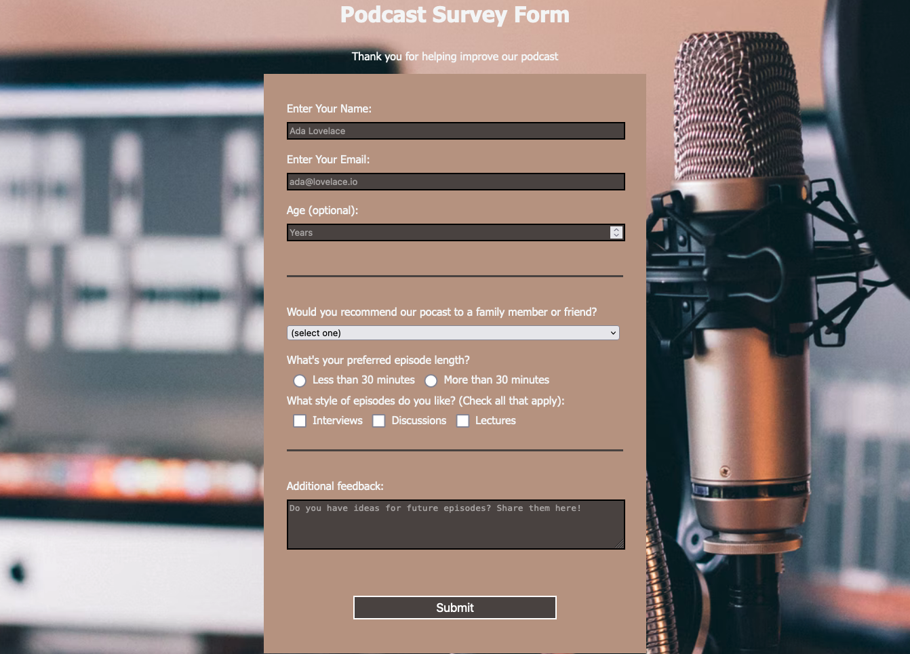

# Contents

- [About](#about)
- [Status](#status)
- [Connect](#connect)

# About

This is a sample survey form I created as part of the [Responsive Web Design course created by freeCodeCamp](https://www.freecodecamp.org/learn/2022/responsive-web-design/). This page is one of the required projects to earn a certification for the course. The [developer certificate](https://www.freecodecamp.org/certification/ananfito/responsive-web-design) I earned as part of completing the course represents approximately 300 hours of coursework.

# Status

This page is a complete, but I continue to make periodic updates to it as I learn more about web development and improve my skills. A live version of this landing page can be viewed at https://ananfito.github.io/survey/survey.

# Connect

- [Twitter](https://twitter.com/wordsbyfifi)
- [LinkedIn](https://linkedin.com/in/anthonynanfito)
- [Portfolio](https://ananfito.github.io)
- [Blog](https://ananfito.hashnode.dev)
